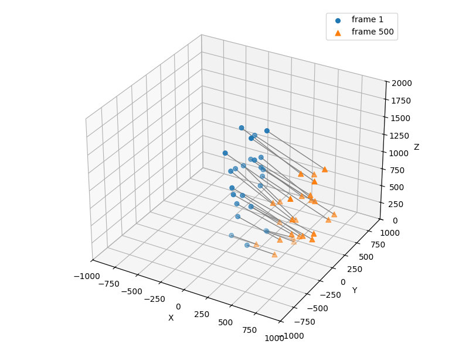

# DSC180A Q1 Project - Point Cloud Matching with MoCap Data
**Authors:** Quy-Dzu Do, Takafumi Matsui, Matt Tokunaga, Caden Pascual  
**Domain:** B06  
**Mentors:** Alex Cloninger, Rayan Saab  

## Overview 
This repository contains the implementation of our Q1 DSC180A replication project. This project focuses on:
- Matching MoCap (motion-capture) point clouds
- Calculating distance mectrics (L1, L2)
- Using optimal transport methods (Wasserstein W1, W2, Gromov-Wasserstein) 
- Evaluating multi-frame matching accuracy

Our goal is to explore how different **distance profile matching** and **accuracy** functions can be applied on MoCap data.


## Repository Structure
```
DSC180A-Q1-Project/
├─ datasets/                          # Folder for all data (raw and processed)
│  ├─ csv_files/                         # MoCap CSV files generated from TXT files (processed)
│  └─ txt_files/                         # Original MoCap TXT files (raw)
├─ src/                               # Root for all Python code
│  ├─ scripts/                          # CLI scripts to run tasks
│  │  ├─ __init__.py                     # Makes scripts/ a Python module
│  │  ├─ download_and_convert.py         # Script with main() to download and convert data
│  │  ├─ graphics.py                     # Script with main() to plot 
│  │  └─ multi_frame_ot.py               # Multi-frame matching animation using OT plans
│  └─ dsc180a_q1_project/             # Main package
│     ├─ __init__.py                     # Exposes key utilities for easy imports
│     ├─ accuracy.py                     # Accuracy functions
│     ├─ utils.py                        # Core classes/functions: LoadCloudPoint, DistanceProfile, plotting
│     └─ download_functions/          # Helper modules for dataset handling
│        ├─ __init__.py                  # Makes datasets/ a Python module
│        ├─ download_mocap.py            # Functions to download MoCap data
│        └─ txt_to_csv.py                # Functions to convert TXT files to CSV   
├─ notebooks/                         # Used for visualizations/experimentation
├─ images/                            # Miscellaneous images
├─ setup.py                # Package setup file, defines dependencies and CLI entry points
├─ requirements.txt        # List of Python dependencies for pip
└─ README.md               # Project documentation
```

### Notebooks

All notebooks are in the `notebooks/` folder and are used for exploration, visualization, and testing of point cloud matching algorithms.

| Notebook | Purpose / Experiments |
| -------- | ------------------- |
| `distance_profile.ipynb`       | Load point clouds, remove outliers, cluster joints, compute distance profiles, visualize skeletons, and evaluate accuracy. |
| `distance_profile_qndo.ipynb`  | Compare distance-profile OT, vanilla OT, and GW OT matchings. Visualize results and compute accuracy curves. |
| `fused_gromov.ipynb`           | Apply Fused Gromov-Wasserstein OT, sweep α parameter, evaluate multi-frame alignment, compare with standard Wasserstein matching. |
| `spectral_clustering.ipynb`    | Cluster joints into body segments using pairwise distances, evaluate consistency across subjects. |
| `takafumi_explore.ipynb`       | Analyze inter-joint stability, temporal variance, and motion-specific trajectory patterns. |
| `test2.ipynb` | Visualize joint-to-joint matching, compute OT/Hungarian matches, evaluate errors. |

## Code Replication
 This project demonstrates point cloud matching on MOCAP data using Optimal Transport, Distance Profiling, and Gromov-Wasserstein methods. All code replication can be done from Terminal. 

### 1. Setup
Follow these steps to clone the repository and set up the environment:

**Clone the Repository**
```bash
git clone https://github.com/qndo1/DSC180A-Q1-Project.git
cd DSC180A-Q1-Project
```
**Set Up and Activate Conda Environment**
```bash
# Create and activate new environment with Python 3.11
conda create -n dsc180a-q1 python=3.11
conda activate dsc180a-q1
```
**Install Dependencies**
```bash
conda install pip
# Install dependencies from requirements.txt
pip install -r requirements.txt
```

**Install the package and dependencies**
```bash
# Install locally in editable mode
pip install -e .
```

### 2. Data Acquisition + Gromov-Wasserstein
This script downloads a sample MoCap file and displays the optimal transport matching between the first and 500th frames. By default, the download and conversion limits are set to 1 for quick testing, but you can remove these limits in src/scripts/download_and_convert.py

```bash 
# Download MoCap file, Runs Gromov-Wasserstein on distant frames
download_csv
```
Example image:  



### 3. Point Cloud Matching and Animation
This script performs **point cloud matching** on a sample MoCap CSV file and then animates the results using Optimal Transport.  
The workflow:
- Loads a MoCap CSV File as 3D point clouds.
- Compares the first frame to subsequent frames using OT.
- Stores matching matrices for each frame.
- Animates point correspondences, red points being the subsequent frames.

```bash
# Run the point cloud matching and animation script
multi_frame_ot
```

### 4. Accuracy Evaluation and Plotting
This script computes three different accuracy metrics across pairs of poses and generates plots comparing multiple matching methods.
The workflow:
- Runs tests across a selected number of poses (default 2).
- Computes accuracy sequences along timesteps away from the starting frame.
- Plots comparisons for:
    - Full accuracy (acc_full)
    - Distance-based accuracy (acc_dist)
    - Accuracy with removed points (acc_rem)
- Matching Methods used:
    - Fused Gromov-Wassserstein (FGW) (α = 0, 0.5, 1)
    - Partial Gromov-Wasserstein (pGW)
    - Dijkstra-based Point Matching (DPM)

```bash
# Run accuracy functions
graphics
```

## Sources/References
1. **Python Optimal Transport (POT)** – Library for optimal transport computations, including Wasserstein and Gromov-Wasserstein distances: [https://pythonot.github.io/](https://pythonot.github.io/)
2. **Motion Capture (MoCap) Dataset** – SFU MoCap database used for point cloud data: [https://mocap.cs.sfu.ca/](https://mocap.cs.sfu.ca/)
3. **Robust Point Matching with Distance Profiles** – Paper introducing distance-profile-based robust point cloud matching: [https://arxiv.org/pdf/2312.12641](https://arxiv.org/pdf/2312.12641)

